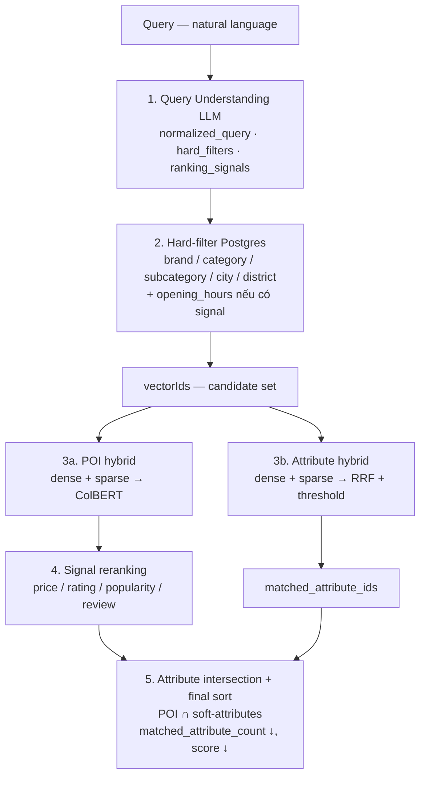

# Tasco Search — Retrieval & Ranking Methodology

## 1. Bài toán

Người dùng tìm địa điểm trên bản đồ bằng ngôn ngữ tự nhiên. Truy vấn thường **không** chỉ rõ một POI cụ thể, mà thể hiện **ý định / ngữ nghĩa** (ví dụ: *“quán cà phê yên tĩnh để làm việc ở Quận 1”*, *“ATM còn mở lúc 23h”*, *“nhà hàng giá rẻ nổi tiếng”*).

Hệ thống cần:

1. Hiểu ý định truy vấn (hard constraints + soft intent + ranking preference).
2. Thu hẹp không gian ứng viên bằng filter cứng khi có thể.
3. Khớp soft-attribute động (không giới hạn cứng bằng taxonomy cố định trong query).
4. Tìm POI liên quan bằng hybrid semantic/lexical search.
5. Kết hợp attribute overlap + signal reranking để xếp hạng kết quả cuối.

**Endpoint chính:** `POST /tasco/search`  
**Orchestrator:** `TascoSearchService` (`app/services/tasco_search.py`)

---

## 2. Tổng quan kiến trúc

Hệ thống tách rõ ba lớp dữ liệu:

| Lớp | Nguồn | Vai trò |
|-----|--------|---------|
| **Hard hints** | `brand`, `category`, `subcategory`, `city`, `district` (+ `opening_hours`) | Filter deterministic trên PostgreSQL |
| **Soft attributes** | Catalog attribute động (`attributes.csv` → Qdrant `attribute_data`) | Khớp ý định trải nghiệm / tiện ích bằng semantic search |
| **POI corpus** | `poi.csv` → Postgres + Qdrant `poi_data` | Hybrid retrieval trong tập đã hard-filter |
| **Ranking signals** | LLM detect từ query; metadata POI (`rating`, `popularity`, …) | Rerank preference sau retrieval |



---

## 3. Dữ liệu đầu vào

### 3.1. POI — `data/processed_data/poi.csv`

Mỗi dòng là một điểm quan tâm với metadata phục vụ cả filter và ranking:

- Định danh / phân loại: `poi_name`, `brand`, `category`, `sub_category`
- Địa lý: `city`, `district`, `address`, `latitude`, `longitude`
- Signal metadata: `rating`, `review_count`, `popularity_score`, `price_level`, `opening_hours`
- Nội dung semantic: `description` (được embed vào Qdrant)
- Liên kết soft: `attributes`, `tags` (quan hệ chuẩn nằm ở `poi_attributes`)

### 3.2. Soft attributes — `data/processed/attributes.csv`

```
attribute_id, attribute_name, description, vector_id
```

Ví dụ: `A001, 24/7, Mở cửa cả ngày`.

Soft-attribute là **tập động**: số lượng lớn, mở rộng được, không thể (và không nên) hard-code toàn bộ vào rule-based parser của query. Vì vậy hệ thống **không** yêu cầu LLM liệt kê hết attribute; thay vào đó dùng **semantic retrieval** trên collection attribute.

### 3.3. Signals — `data/processed_data/signals.csv`

Catalog mô tả các loại tín hiệu xếp hạng / ràng buộc (price, rating, popularity, opening_hours, semantic, attribute, …). Runtime dùng enum + LLM detection; CSV phục vụ seed / tài liệu hóa.

### 3.4. Liên kết POI ↔ Attribute

Bảng `poi_attributes` (Postgres) map nhiều-nhiều. Sau khi retrieve POI và attribute riêng, hệ thống **giao tập** để giữ POI thực sự mang soft-intent của query.

---

## 4. Hiểu và phân tích truy vấn (Query Understanding)

**Module:** `QueryUnderstander` (`app/helpers/query_understand.py`)  
**Prompt:** `app/prompts/main.py`  
**LLM:** LiteLLM gateway, temperature thấp (`0.1`) để ổn định JSON.

### 4.1. Đầu ra có cấu trúc

| Trường | Ý nghĩa |
|--------|---------|
| `normalized_query` | Câu tiếng Việt chuẩn hóa (sửa dấu, mở rộng viết tắt: q1→Quận 1, hcm→TP.HCM, …) — dùng làm query cho vector search |
| `hard_filters` | `brand`, `category`, `subcategory`, `city`, `district` — chỉ điền khi LLM **chắc chắn** extract được |
| `ranking_signals[]` | `{signal, confidence, opening_hours?}` — preference / ràng buộc mềm hoặc cứng theo loại |

### 4.2. Hard filters vs soft intent

- **Hard:** thực thể có thể map trực tiếp sang cột DB (thương hiệu, loại hình, địa bàn).
- **Soft:** ý định trải nghiệm (“yên tĩnh”, “có wifi”, “phù hợp làm việc”) → không ép vào hard filter; để nhánh attribute hybrid search xử lý.

### 4.3. Ranking signals (LLM detect)

Một số signal tiêu biểu:

| Signal | Vai trò trong pipeline |
|--------|-------------------------|
| `opening_hours` | **Hard filter** sau DB (open_time / close_time / is_24h) |
| `price` | Rerank theo `priceLevel` (thấp hơn = tốt hơn với intent “giá rẻ”) |
| `rating` | Rerank theo `rating` |
| `popularity` | Rerank theo `popularityScore` |
| `review` | Rerank theo `reviewCount` |
| `attribute` / `attributes` / `semantic` | Đánh dấu intent mềm; khớp thực tế qua vector attribute search |
| `location` / `category` / `mixed_language` | Metadata hiểu query; không phải cột sort chính của reranker hiện tại |

Post-process: chuẩn hóa chuỗi hard-filter, normalize giờ HH:MM, dedupe signal (giữ confidence cao nhất), sort theo confidence. Nếu không có signal nào → inject `semantic` với confidence `0.5`.

---

## 5. Lọc dữ liệu (Hard-filter)

**Module:** `Store.filter_hard_hint` (`app/services/store.py`)

### 5.1. Filter trên PostgreSQL

Match kiểu `contains` + `mode: insensitive`:

- `city`, `district` trên bảng `poi`
- `brand`, `category`, `subcategory` qua relation `brand`

Mục tiêu: **giảm mạnh candidate set** trước khi chạy vector search đắt hơn.

### 5.2. Cascade category → subcategory

1. Có cả `category` và `subcategory` → lọc category trước.
2. Lọc tiếp subcategory in-memory.
3. Nếu subcategory = 0 POI → **rollback** về kết quả category (tránh over-filter do extract quá hẹp).

### 5.3. Opening hours như hard constraint

Khi có signal `opening_hours` (confidence cao nhất):

- `is_24h` → POI phải 24/7
- `open_time` → POI đã mở tại thời điểm đó
- `close_time` → POI còn mở tại thời điểm đó

Đây là filter cứng sau query DB, không phải soft rerank.

### 5.4. Đầu ra stage này

Danh sách POI + `vectorId` → dùng làm `HasId` filter khi search collection POI trên Qdrant. Nếu không còn `vectorId` hợp lệ → trả kết quả rỗng sớm.

---

## 6. Soft-attribute: khớp ý định động bằng semantic search

### 6.1. Vì sao cần collection riêng?

Soft-attribute gần như **không giới hạn**. Rule-based hoặc LLM liệt kê hết attribute từ query sẽ brittle và miss paraphrase (“chỗ ngồi làm việc” ↔ “phù hợp làm việc” / “ổ cắm”).

Giải pháp:

1. Embed toàn bộ `attribute_name` + `description` vào collection `attribute_data`.
2. Hybrid search `normalized_query` ↔ attribute corpus.
3. Lấy top attribute vượt ngưỡng → `matched_attribute_ids`.
4. Sau POI retrieval, chỉ giữ POI có giao với tập attribute này.

### 6.2. Không phải score fusion POI↔attribute

Soft-attribute **không** cộng điểm trực tiếp vào vector score POI. Cơ chế là **set intersection** sau retrieval:

```
overlap = poi_attribute_ids ∩ matched_attribute_ids
giữ POI nếu overlap ≠ ∅
```

Nếu attribute search không trả hit nào (dưới RRF threshold) → kết quả cuối **rỗng**, dù POI hits vẫn có. Đây là thiết kế “soft-intent phải được chứng minh bằng attribute overlap”.

---

## 7. Tìm kiếm semantic / lexical (Hybrid Vector Search)

**Module:** `VectorStore` (`app/services/vector_store.py`)  
**Embedding:** BGE-M3 → đồng thời **dense**, **sparse (lexical weights)**, và (với POI) **ColBERT multi-vector**.

Hai collection được cấu hình **khác nhau có chủ đích** — đây là tinh túy retrieval của hệ thống.

### 7.1. So sánh cấu hình collection

| Khía cạnh | **POI** (`poi_data`) | **Attribute** (`attribute_data`) |
|-----------|----------------------|----------------------------------|
| Vectors | dense + sparse + **ColBERT** | dense + sparse (**không** ColBERT) |
| Dense index | HNSW tùy chỉnh + TurboQuant 1.5-bit | Dense on-disk đơn giản |
| ColBERT | FLOAT16, MaxSim, `hnsw m=0` | — |
| Upsert | dense + sparse + ColBERT | dense + sparse |
| Search fusion | Prefetch dense+sparse → **ColBERT rerank** | Prefetch dense+sparse → **RRF** |
| Prefetch mặc định | 100 | `ATTRIBUTE_SEARCH_PREFETCH_LIMIT` (50) |
| Score threshold | Không | `ATTRIBUTE_SEARCH_RRF_THRESHOLD` (env: 0.5) |
| Scope search | Chỉ trong `vectorIds` đã hard-filter | Toàn collection |
| Document embed | `Poi.description` | Attribute name/description |
| Payload id | `poi_id` | `attribute_id` |
| Top-K mặc định | `TASCO_POI_TOP_K` = 20 | `TASCO_ATTRIBUTE_TOP_K` = 20 |

### 7.2. Vì sao POI dùng ColBERT?

POI description dài hơn, cần **token-level late interaction** (MaxSim) để phân biệt nuance giữa các địa điểm tương tự trong cùng category/khu vực. Dense+sparse prefetch tạo candidate pool; ColBERT rerank chọn top-k chính xác hơn.

Dense branch POI dùng quantization rescore + oversampling `3.0` để cân bằng tốc độ/độ chính xác khi có TurboQuant.

### 7.3. Vì sao Attribute dùng RRF (không ColBERT)?

Attribute ngắn, số lượng nhỏ hơn, mục tiêu là **recall intent labels** ổn định. Reciprocal Rank Fusion kết hợp lexical (sparse) và semantic (dense) đơn giản, có **threshold** để loại match yếu — tránh soft-filter quá nhiễu.

### 7.4. Parallel search

Sau hard-filter, POI search và attribute search chạy **song song** (`asyncio.gather`) trên cùng `normalized_query`.

---

## 8. Kết hợp và xếp hạng kết quả

Pipeline ranking là **đa tầng**, không phải một công thức score duy nhất.

### 8.1. Tầng 1 — Hard filter (recall gate)

Loại POI không thỏa brand/category/geo/opening hours. Giảm không gian trước retrieval.

### 8.2. Tầng 2 — Hybrid retrieval score

- **POI:** thứ tự từ ColBERT MaxSim trong candidate set.
- **Attribute:** thứ tự từ RRF, cắt theo threshold rồi top-k.

### 8.3. Tầng 3 — Signal reranking (preference)

**Module:** `rerank_poi_hits_by_signals` (`app/helpers/poi_signal_reranker.py`)

Chạy **sau** POI vector search, **trước** attribute intersection.

Signals được rerank: `price`, `rating`, `popularity`, `review`.

Ánh xạ cột:

| Signal | Cột POI | Hướng tối ưu |
|--------|---------|--------------|
| `price` | `priceLevel` | Thấp hơn tốt hơn → sort key = `-price_level` |
| `rating` | `rating` | Cao hơn tốt hơn |
| `popularity` | `popularityScore` | Cao hơn tốt hơn |
| `review` | `reviewCount` | Cao hơn tốt hơn |

**Cơ chế sort:** lexicographic multi-key theo thứ tự confidence signal (cao → thấp), vector score là tiebreaker:

```
sort_key = (signal_1_value, signal_2_value, ..., vector_score)
sorted(..., reverse=True)
```

Không dùng weighted sum dạng `α·semantic + β·rating`. Ưu tiên preference người dùng theo độ tin cậy LLM detect, rồi mới đến độ tương đồng vector.

### 8.4. Tầng 4 — Soft-attribute intersection

Với mỗi POI hit:

1. Lấy `attribute_ids` từ Postgres (`get_attribute_ids_by_poi_ids`).
2. Tính `overlap` với `matched_attribute_ids`.
3. Loại POI không overlap.
4. Ghi `matched_attribute_count` và `matched_attribute_ids`.

### 8.5. Tầng 5 — Final ranking

```
sort by: matched_attribute_count ↓, then vector score ↓
```

POI khớp **nhiều soft-attribute** của query được ưu tiên hơn POI chỉ có score semantic cao nhưng ít overlap intent.

---

## 9. Tóm tắt vai trò từng thành phần

| Thành phần | Câu hỏi trả lời | Cơ chế |
|------------|-----------------|--------|
| LLM Query Understand | Query muốn gì? Constraint cứng nào? Preference nào? | Structured extraction |
| Postgres hard-filter | POI nào chắc chắn không liên quan? | SQL / Prisma contains |
| Attribute hybrid | Query khớp soft-attribute nào? | Dense + sparse + RRF |
| POI hybrid | Trong candidate set, POI nào gần ngữ nghĩa nhất? | Dense + sparse + ColBERT |
| Signal reranker | Trong các POI gần nghĩa, cái nào đúng preference hơn? | Multi-key sort trên metadata |
| Attribute intersect | POI nào thực sự mang soft-intent? | Set intersection |
| Final sort | Thứ tự trả về user? | Attribute overlap rồi score |

---

## 10. Ví dụ minh họa luồng

**Query:** *“cf yên tĩnh làm việc q1 giá rẻ”*

1. **Understand**
   - `normalized_query`: “cà phê yên tĩnh để làm việc ở Quận 1 giá rẻ”
   - `hard_filters`: category ≈ quán cà phê, district ≈ Quận 1
   - `signals`: `price` (cao), có thể `attribute`/`semantic`

2. **Hard-filter** → POI cà phê Quận 1 (giảm mạnh corpus).

3. **Parallel**
   - Attribute search → ví dụ: “yên tĩnh”, “phù hợp làm việc”, “ổ cắm”, …
   - POI search (trong vectorIds) → top mô tả gần “làm việc / yên tĩnh”.

4. **Rerank** theo `price` → ưu tiên `priceLevel` thấp.

5. **Intersect** → chỉ giữ quán có attribute overlap với intent.

6. **Final** → quán vừa đúng khu vực, vừa đúng soft-intent, vừa hợp preference giá.

---

## 11. Tham số cấu hình chính

| Biến môi trường | Vai trò | Giá trị tham chiếu |
|-----------------|---------|-------------------|
| `QDRANT_POI_COLLECTION` | Collection POI | `poi_data` |
| `QDRANT_ATTRIBUTE_COLLECTION` | Collection attribute | `attribute_data` |
| `EMBEDDING_SERVICE_MODEL` | Model embed | `bge-m3` |
| `EMBEDDING_SIZE` | Dim dense/ColBERT | `1024` |
| `ATTRIBUTE_SEARCH_PREFETCH_LIMIT` | Prefetch attribute | `50` |
| `ATTRIBUTE_SEARCH_RRF_THRESHOLD` | Ngưỡng RRF attribute | `0.5` |
| `TASCO_POI_TOP_K` | Top POI sau hybrid | `20` |
| `TASCO_ATTRIBUTE_TOP_K` | Top attribute | `20` |
| `QDRANT_HNSW_M` / `EF_CONSTRUCT` | HNSW POI dense | `32` / `200` |

---

## 12. Điểm thiết kế cốt lõi

1. **Tách hard vs soft:** hard giảm candidate deterministic; soft xử lý intent mở bằng retrieval.
2. **Hai collection, hai chiến lược fusion:** ColBERT cho POI (precision trên mô tả dài); RRF + threshold cho attribute (ổn định trên nhãn ngắn).
3. **Soft-attribute là gate, không chỉ là feature score:** overlap bắt buộc trước khi trả kết quả.
4. **LLM không thay retrieval:** LLM chỉ extract cấu trúc; matching semantic vẫn do embedding + hybrid search.
5. **Ranking đa tầng:** filter → retrieve → preference rerank → intent intersect → final sort.

---