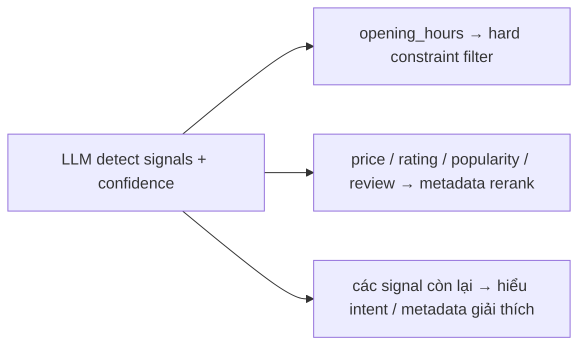
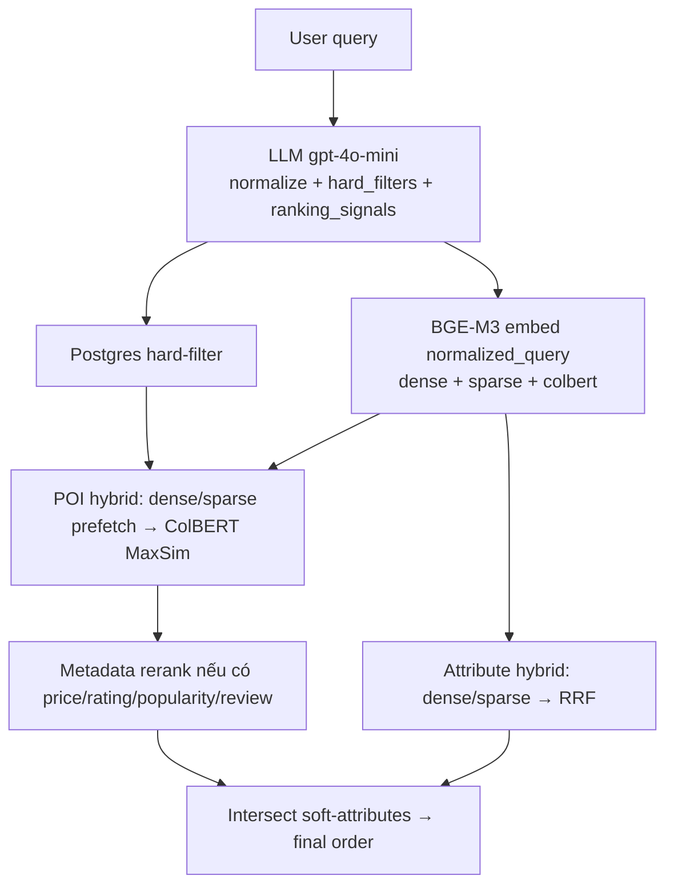

# Ranking Signals & AI Models

Tài liệu giải thích cho stakeholder / customer: hệ thống xác định **ranking signals** như thế nào, dùng **model AI** nào, và cách **giải thích kết quả** trả về.

---

## 1. Tóm tắt nhanh (executive)

| Hạng mục | Hệ thống hiện tại |
|---|---|
| **Semantic similarity** | Dense vector (BGE-M3) — Cosine trên Qdrant |
| **Keyword / lexical score** | Sparse lexical weights (BGE-M3) — tương đương hướng BM25/lexical, không dùng Elasticsearch BM25 riêng |
| **Late-interaction rerank** | ColBERT MaxSim (BGE-M3 multi-vector) trên collection POI |
| **Intent / soft-attribute fit** | Hybrid dense+sparse + RRF trên taxonomy attribute; đo bằng `matched_attribute_ids` |
| **Rating / popularity / review / price** | LLM detect signal → rerank theo cột metadata POI |
| **Khoảng cách địa lý (GPS distance)** | Chưa dùng Haversine/geo-rank; địa lý hiện xử lý qua hard-filter `city` / `district` |
| **LTR (Learning-to-Rank) model** | Chưa dùng model LTR riêng; ranking là pipeline đa tầng có giải thích được |
| **LLM** | Query Understanding — mặc định `gpt-4o-mini` qua LiteLLM |
| **Embedding** | `bge-m3` (dense + sparse + ColBERT) qua gRPC embedding service |

---

## 2. AI models được sử dụng

### 2.1. LLM — Query Understanding

| Thuộc tính | Giá trị |
|---|---|
| Gateway | LiteLLM (`app/utils/llm_partern.py`) — đổi provider không cần sửa code gọi |
| Provider mặc định | `openai` |
| Model mặc định | `gpt-4o-mini` |
| Temperature (understand) | `0.1` (override thấp hơn config chung để ổn định JSON) |
| Output | JSON có cấu trúc (`response_format=json_object`) |

**Vai trò LLM (không phải ranker cuối):**

1. Chuẩn hóa query → `normalized_query` (sửa dấu, mở rộng viết tắt, thống nhất ngôn ngữ).
2. Trích **hard filters** khi chắc chắn: `brand`, `category`, `subcategory`, `city`, `district`.
3. Detect **ranking signals** kèm `confidence` ∈ [0, 1].
4. Với signal `opening_hours`: trích thêm `open_time` / `close_time` / `is_24h`.

LLM **không** chấm điểm từng POI và **không** liệt kê soft-attribute cụ thể. Soft-attribute được resolve bằng embedding search.

### 2.2. Embedding — BGE-M3 (hybrid)

| Thuộc tính | Giá trị |
|---|---|
| Model | `bge-m3` |
| Dim dense | 1024 |
| Outputs mỗi text | `dense_vector` + `sparse_weights` + `colbert_vectors` |
| Service | gRPC embedding (`EMBEDDING_SERVICE_URL`) |

Ba kênh embedding map trực tiếp sang các “score type” customer thường hỏi:

| Kênh BGE-M3 | Tương đương khái niệm customer | Dùng ở đâu |
|---|---|---|
| **Dense** | Semantic similarity | Prefetch POI + Attribute |
| **Sparse (lexical weights)** | Keyword / BM25-like lexical match | Prefetch POI + Attribute |
| **ColBERT multi-vector** | Token-level late-interaction reranker | Final score POI (MaxSim) |

Không có model reranker / LTR tách riêng (ví dụ cross-encoder hay LambdaMART). **ColBERT MaxSim** đóng vai trò neural reranker trong nhánh POI; **RRF** đóng vai trò fusion ranker trong nhánh attribute.

---

## 3. Ranking signals — định nghĩa & cách detect

### 3.1. Nguồn detect

Signals được LLM phát hiện theo rule trong prompt (`SIGNAL_DETECTION_RULES` + `SYSTEM_PROMPT`).

Mỗi signal trả về:

```json
{ "signal": "<enum>", "confidence": 0.0-1.0, "opening_hours": null | {...} }
```

Post-process:

- Dedupe theo loại signal (giữ confidence cao nhất).
- Nếu không detect được signal nào → thêm mặc định `semantic` với confidence `0.5`.
- Sort theo confidence giảm dần — thứ tự này ảnh hưởng **thứ tự ưu tiên** khi signal-rerank.

### 3.2. Catalog signals (runtime enum)

| Signal | Khi nào LLM bật | Confidence phản ánh gì |
|---|---|---|
| `mixed_language` | Query trộn Việt–Anh đáng kể | Độ rõ của hiện tượng đa ngôn ngữ |
| `opening_hours` | Có ràng buộc giờ / 24/7 | Độ chắc của constraint thời gian |
| `price` | Rẻ / bình dân / cao cấp / đắt | Độ rõ preference giá |
| `popularity` | Nổi tiếng / đông / trending / check-in | Độ rõ preference phổ biến |
| `location` | Landmark + gần/xung quanh, hoặc khu vực địa lý | Có intent địa lý trong câu |
| `category` | Nhắc loại POI rõ (cafe, ATM, bệnh viện, …) | Độ rõ loại hình |
| `attribute` | Một thuộc tính cụ thể (wifi, toilet, view, …) | Có soft-intent đơn |
| `attributes` | Nhiều thuộc tính / trải nghiệm kết hợp | Soft-intent đa điều kiện |
| `semantic` | Intent mơ hồ, khó hard-map | Query thiên về ngữ nghĩa |
| `rating` | Ngon / tốt nhất / đáng thử / uy tín | Preference chất lượng |
| `review` | Tính chất kiểu review: yên tĩnh, kid-friendly, romantic | Preference trải nghiệm chủ quan |

### 3.3. Mapping “customer score types” → cơ chế thật

| Customer hỏi | Hệ thống đáp ứng bằng | Ghi chú |
|---|---|---|
| Semantic similarity | Dense Cosine + (POI) ColBERT MaxSim | Score chính của POI hit = ColBERT |
| Keyword / BM25 | Sparse lexical weights trong hybrid prefetch | Không phải BM25 engine riêng |
| Intent fit | Attribute hybrid (RRF) + `matched_attribute_count` | Soft-intent measurable |
| Rating | Signal `rating` → sort theo `poi.rating` | Chỉ khi LLM detect |
| Popularity | Signal `popularity` → `poi.popularityScore` | Chỉ khi LLM detect |
| Review count | Signal `review` → `poi.reviewCount` | Chỉ khi LLM detect |
| Price preference | Signal `price` → `-poi.priceLevel` (thấp hơn = tốt hơn) | Chỉ khi LLM detect |
| Geo distance | Hard-filter `city`/`district`; chưa rank theo mét | Roadmap nếu cần GPS |
| LTR model | Không | Ranking = multi-stage explainable pipeline |

---

## 4. Mỗi signal được “tiêu thụ” thế nào trong pipeline

Không phải mọi signal đều vào cùng một công thức điểm. Hệ thống **phân vai** signal:



### 4.1. `opening_hours` → hard constraint (không chỉ “boost”)

Khi có signal này, hệ thống lọc POI theo preference:

| Field | Ý nghĩa | Ví dụ query |
|---|---|---|
| `open_time` | POI phải **đã mở** tại mốc đó | “ATM mở lúc 4h” → `04:00` |
| `close_time` | POI phải **còn mở** tới mốc đó | “còn mở lúc 23:00” → `23:00` |
| `is_24h` | Bắt buộc 24/7 | “mở cả ngày” |

Prompt phân biệt rõ cue tiếng Việt: *“còn mở”* → `close_time`; *“mở / mở cửa lúc”* → `open_time`.

### 4.2. `price` / `rating` / `popularity` / `review` → signal reranker

Module: `rerank_poi_hits_by_signals`.

- Chỉ chạy khi ≥1 trong 4 signal trên xuất hiện.
- Sort lexicographic theo **thứ tự confidence** (cao trước), vector score là tie-breaker.
- Không dùng weighted sum kiểu `0.4·semantic + 0.3·rating + …` — ưu tiên preference user theo độ tin cậy LLM.

| Signal | Cột POI | Hướng |
|---|---|---|
| `price` | `priceLevel` | Thấp hơn tốt hơn |
| `rating` | `rating` | Cao hơn tốt hơn |
| `popularity` | `popularityScore` | Cao hơn tốt hơn |
| `review` | `reviewCount` | Cao hơn tốt hơn |

Giá trị thiếu → xuống cuối (`-inf`).

### 4.3. `attribute` / `attributes` / `semantic` → dẫn soft retrieval

Các signal này báo hiệu query mang soft-intent. Việc khớp cụ thể không hard-code từ LLM, mà:

1. Embed `normalized_query` bằng BGE-M3.
2. Hybrid search collection `attribute_data` (dense + sparse → **RRF**).
3. Giữ attribute vượt `ATTRIBUTE_SEARCH_RRF_THRESHOLD`.
4. Intersect với `poi_attributes` của từng POI candidate.

**Mức độ phù hợp intent** đo bằng:

- `matched_attribute_ids` — attribute nào khớp
- `matched_attribute_count` — khớp bao nhiêu (ưu tiên final sort)

### 4.4. `category` / `location` / `mixed_language`

| Signal | Vai trò hiện tại |
|---|---|
| `category` | Thường đi kèm hard-filter `category`/`subcategory` (filter DB); signal còn lại phục vụ explain |
| `location` | Địa lý cứng qua `city`/`district`; chưa tính khoảng cách GPS tới user/landmark |
| `mixed_language` | LLM đã chuẩn hóa sang `normalized_query` tiếng Việt; signal ghi nhận hiện tượng đa ngôn ngữ |

---

## 5. Các tầng ranking (để giải thích “vì sao POI này đứng trên”)

Ranking là **đa tầng**, mỗi tầng trả lời một câu hỏi khác nhau:

| Tầng | Câu hỏi | Cơ chế | Score / bằng chứng |
|---|---|---|---|
| 1. Hard filter | POI nào chắc chắn không liên quan? | Postgres: brand/category/geo + opening hours | `hard_filtered_poi_count` |
| 2. Hybrid retrieval | Trong candidate, POI nào gần ngữ nghĩa/lexical nhất? | Dense+sparse prefetch → **ColBERT MaxSim** | `item.score` |
| 3. Soft-intent match | Query khớp soft-attribute nào? | Attribute RRF + threshold | `attribute_hits[]` |
| 4. Preference rerank | User muốn rẻ / ngon / nổi tiếng? | Multi-key sort metadata | `ranking_signals` + cột POI |
| 5. Final order | Ai khớp intent nhiều nhất? | `matched_attribute_count` ↓ rồi `score` ↓ | fields trên mỗi item |

**Không có** một scalar “final_score = w1·… + w2·…” duy nhất. Điều này cố ý: mỗi tầng giải thích được bằng field trong response.

---

## 6. Cách giải thích kết quả cho end-user / QA / customer

### 6.1. Field trong API response dùng để explain

Response `TascoSearchResponse` cung cấp “audit trail” của quyết định:

| Field | Dùng để nói gì với khách |
|---|---|
| `original_query` | Câu gốc user gõ |
| `normalized_query` | Hệ thống hiểu query thành gì (sau chuẩn hóa LLM) |
| `hard_filters` | Ràng buộc cứng đã áp (ví dụ chỉ Quận 1, chỉ quán cà phê) |
| `ranking_signals` | Preference / intent signals + confidence |
| `hard_filtered_poi_count` | Không gian ứng viên sau filter |
| `attribute_hits` | Soft-attribute semantic nào được kích hoạt (kèm RRF score) |
| `items[].score` | Độ tương đồng hybrid POI (ColBERT) |
| `items[].matched_attribute_ids` | Intent attributes cụ thể POI thỏa |
| `items[].matched_attribute_count` | Độ phủ soft-intent |

### 6.2. Template giải thích kết quả (có thể dùng trong demo / UI)

**Ví dụ query:** *“cf yên tĩnh có wifi làm việc q1 giá ổn”*

1. **Hiểu query**  
   `normalized_query` ≈ “cà phê yên tĩnh có wifi để làm việc ở Quận 1, giá ổn”.

2. **Ràng buộc cứng**  
   `hard_filters`: category ≈ quán cà phê, district ≈ Quận 1 → chỉ search trong tập này.

3. **Signals**  
   - `price` (confidence cao) → ưu tiên `priceLevel` thấp hơn.  
   - `attributes` / `review` → soft-intent trải nghiệm.

4. **Soft-intent**  
   `attribute_hits` có thể gồm wifi, yên tĩnh, phù hợp làm việc, …  
   POI được giữ vì `matched_attribute_ids` giao với các attribute đó.

5. **Vì sao POI A đứng trên POI B**  
   - A khớp nhiều soft-attribute hơn (`matched_attribute_count`), **hoặc**  
   - Cùng số attribute nhưng ColBERT `score` cao hơn, **hoặc**  
   - Trong bước signal rerank, A tốt hơn theo preference (ví dụ rẻ hơn / rating cao hơn) theo thứ tự confidence.

### 6.3. Câu trả lời mẫu khi customer hỏi từng loại score

**“Các bạn có dùng semantic similarity không?”**  
Có — dense embedding BGE-M3 (Cosine). Với POI, semantic/lexical candidate còn được ColBERT MaxSim rerank token-level.

**“Có BM25 không?”**  
Không dùng BM25 engine riêng. Lexical match đến từ **sparse lexical weights của BGE-M3**, kết hợp dense trong hybrid search (và RRF ở nhánh attribute).

**“Ranking theo khoảng cách địa lý thế nào?”**  
Hiện tại địa lý được xử lý như **hard constraint** (`city`/`district` do LLM extract). Chưa rank theo khoảng cách mét tới GPS user/landmark. Signal `location` được detect để hiểu intent; roadmap có thể bổ sung geo-distance feature.

**“Rating / popularity / review count?”**  
Có — nhưng **conditional**: chỉ khi query thể hiện preference tương ứng (LLM gán signal + confidence). Khi đó metadata POI được dùng để rerank trước bước giao soft-attribute.

**“Mức độ phù hợp intent?”**  
Đo bằng overlap soft-attribute: `matched_attribute_count` / `matched_attribute_ids`, sau khi attribute được retrieve bằng hybrid+RRF từ taxonomy động.

**“Có embedding model / reranker / LTR không?”**  
- Embedding: **BGE-M3** (dense + sparse + ColBERT).  
- Reranker neural: **ColBERT MaxSim** (POI).  
- Fusion ranker: **RRF** (attribute).  
- Preference rerank: rule/metadata multi-key (không phải LTR learned).  
- LTR supervised: **chưa dùng**.

---

## 7. Prompt — logic detect signal (rút gọn từ source)

LLM được hướng dẫn:

1. Chỉ điền hard-filter khi **chắc chắn**; không đoán → `null`.
2. Có thể bật **nhiều signals cùng lúc**.
3. Mỗi signal có `confidence` 0–1.
4. `opening_hours` object **chỉ** được điền khi signal = `opening_hours`.
5. Chuẩn hóa query: sửa dấu, expand viết tắt (`q1`→Quận 1, `hcm`→TP.HCM, `cf`→cà phê, …), dịch phần mô tả Việt–Anh nhưng giữ brand quốc tế.

Detection cues (từ `SIGNAL_DETECTION_RULES`):

| Signal | Cue trong prompt |
|---|---|
| `price` | cheap, affordable, upscale, expensive |
| `popularity` | famous, check-in, crowded, trending |
| `rating` | delicious, best, worth visiting, reputable |
| `review` | quiet, kid-friendly, romantic |
| `attribute` / `attributes` | wifi, toilet, nice view / nhiều thuộc tính kết hợp |
| `semantic` | phrasing mơ hồ, không hard-map được |
| `opening_hours` | time constraint → extract HH:MM hoặc `is_24h` |

---

## 8. Model stack theo giai đời request



---

## 9. Ranh giới hiện tại & hướng mở rộng (minh bạch với customer)

| Đã có | Chưa có / có thể mở rộng |
|---|---|
| Hybrid semantic + lexical + ColBERT | Cross-encoder reranker riêng |
| Signal-aware metadata rerank | Learned LTR (LambdaMART / neural LTR) trên click/eval |
| Soft-intent qua attribute taxonomy | Geo-distance ranking (Haversine / S2) |
| Explainable multi-stage fields trong API | Một `final_score` có trọng số học được |
| LLM confidence điều khiển thứ tự preference | Online A/B weight tuning |

---

## 10. Kết luận cho customer

Hệ thống ranking **không** dựa trên một model LTR duy nhất, mà là pipeline giải thích được:

1. **LLM** đọc ý định → hard constraints + ranking signals + confidence.  
2. **BGE-M3** cung cấp semantic (dense), keyword-like (sparse), và neural rerank (ColBERT).  
3. **Soft-intent** được materialize thành attribute IDs có điểm RRF.  
4. **Preference** (giá / rating / popularity / review) chỉ boost khi user thực sự nhắc tới.  
5. Kết quả cuối ưu tiên POI **khớp nhiều soft-attribute nhất**, rồi mới tới độ tương đồng vector — và mọi bước đều có field để giải thích.
