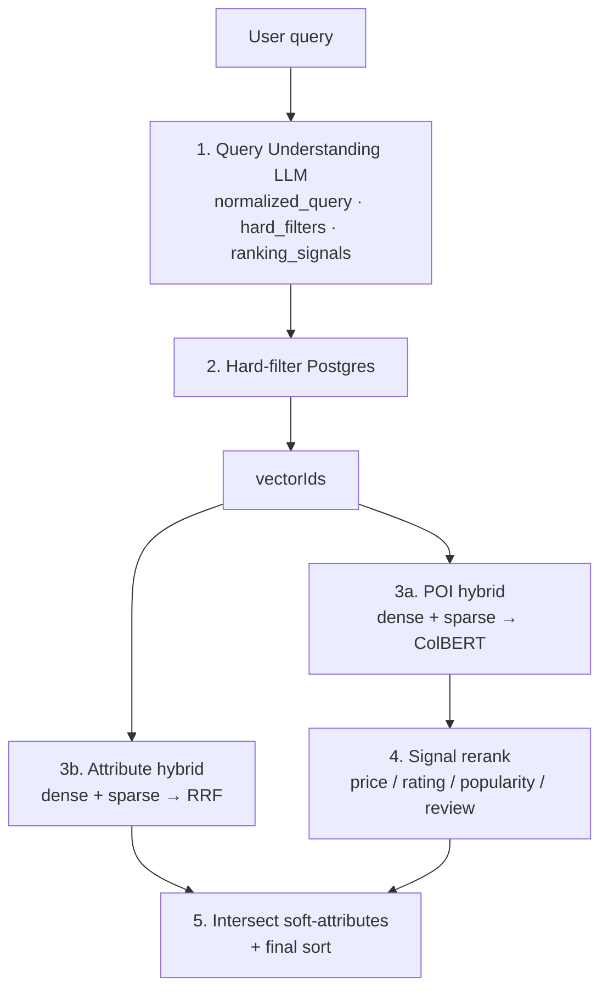

# AI Semantic Search & Ranking

> AI-powered semantic search and ranking for Point of Interest (POI) discovery.  
> **AABW Hackathon 2026 — Tasco Track P7**


---

## 📋 Table of Contents

| # | Section | What's inside |
|---|---------|---------------|
| 1 | [📌 Overview](#-overview) | What the system does, problem it solves, and a sample query |
| 2 | [✨ Key Features](#-key-features) | Six distinctive technical capabilities of this pipeline |
| 3 | [🛠️ Tech Stack](#-tech-stack) | AI/ML models, backend services, and frontend breakdown |
| 4 | [🏗️ Architecture](#-architecture) | Runtime topology (service graph) + 6-stage search pipeline with Mermaid diagram |
| 5 | [🚀 Getting Started](#-getting-started) | Prerequisites, model download, env setup, `make dev`, DB init, and first query |
| 6 | [📁 Project Structure](#-project-structure) | Directory layout with role annotations |
| 7 | [🔌 API Reference](#-api-reference) | All endpoints, `curl` example, and full JSON response shape |
| 8 | [⚙️ Configuration](#-configuration) | Every environment variable with defaults and descriptions |
| 9 | [📊 Evaluation](#-evaluation) | How to run the eval script, metrics explained, and illustrative benchmark results |
| 10 | [🔄 Development Workflow](#-development-workflow) | Adding POIs, expanding attribute taxonomy, swapping LLM, debugging per stage |
| 11 | [📚 Technical Documentation](#-technical-documentation) | Links to methodology and AI model docs in `AICore/docs/` |
| 12 | [👥 Team](#-team) | Contributors |

---

## 📌 Overview

Users search for locations on a map using natural language queries that carry **intent and semantics** rather than exact place names:

> *"quiet café with WiFi for working in District 1"*  
> *"ATM still open at 11 PM"*  
> *"popular budget restaurant"*

This system resolves such queries through a multi-stage pipeline: an LLM extracts structured constraints from free-form text, a PostgreSQL hard-filter reduces the candidate space, and a hybrid semantic search (dense + sparse + ColBERT rerank) ranks the results — with explainable output at every stage.

---

## ✨ Key Features

- **Hybrid embedding in a single model** — BGE-M3 outputs dense (semantic), sparse (lexical/BM25-like), and ColBERT multi-vector representations from one inference call, eliminating separate retrieval systems.
- **Dynamic soft-attribute taxonomy** — attributes (wifi, quiet, suitable for work, 24/7, …) are stored as embeddings and matched via semantic search, not hard-coded enum rules. The taxonomy expands without code changes.
- **LLM query normalization** — GPT-4o-mini (via LiteLLM) handles Vietnamese slang, abbreviations, and mixed-language input ("cf q1 hcm" → structured filters + ranking signals).
- **Parallel retrieval branches** — POI hybrid search and attribute hybrid search run concurrently; results are intersected at the final step.
- **Explainable results** — every response includes `matched_attribute_ids` and `ranking_signals`, providing a full audit trail for stakeholders.
- **Provider-agnostic LLM** — swap between OpenAI, Azure, Anthropic, or any LiteLLM-compatible provider by changing two env vars; no code changes required.

---

## 🛠️ Tech Stack

### AI / ML

| Component | Technology | Role |
| --- | --- | --- |
| Query Understanding | **GPT-4o-mini** via **LiteLLM** | Normalize query, extract hard filters & ranking signals (confidence scored) |
| Embedding | **BGE-M3** (local, gRPC) | Dense (1024-dim) + Sparse (lexical) + ColBERT (late-interaction) |
| Vector DB | **Qdrant** | Collections: `poi_data`, `attribute_data` |
| POI rerank | **ColBERT MaxSim** | Token-level late-interaction rerank within filtered candidate set |
| Attribute fusion | **RRF** (Reciprocal Rank Fusion) | Merge dense + sparse attribute scores with configurable threshold |

### Backend & Infrastructure

| Component | Technology |
| --- | --- |
| API | FastAPI + `uv` (Python ≥ 3.12) |
| ORM | Prisma (PostgreSQL) |
| Database | PostgreSQL 15+ |
| Embedding service | gRPC Python service (BGE-M3) |
| Orchestration | Docker Compose + Makefile |
| Gateway (prod) | Nginx + Certbot (HTTPS) |
| Package manager | **uv** (`uv sync` / `uv run`) |

### Frontend

| Component | Technology |
| --- | --- |
| UI | Next.js 14 (App Router) |
| Interaction | Vietnamese search input → `/tasco/search` → query analysis + ranked POI results |

---

## 🏗️ Architecture

### Runtime

```
Browser ──▶ Nginx (80/443) ──▶ frontend (Next.js :3000)
                            ╲
                             ▶ aicore-api (FastAPI :8000)
                                   │
              ┌────────────────────┼────────────────────┐
              ▼                    ▼                    ▼
         PostgreSQL             Qdrant           aicore-embedding
      (brands/poi/attrs/     poi_data +          gRPC :50051
       signals/tags)         attribute_data      BGE-M3 (CPU)
```

### Search Pipeline — `POST /tasco/search`



| Stage | Inputs | Outputs |
| --- | --- | --- |
| **Query Understanding** | Raw query string | `normalized_query`, `hard_filters`, `ranking_signals[]` |
| **Hard filter** | `hard_filters` → PostgreSQL | `vectorIds[]` (candidate set) |
| **POI hybrid** | `vectorIds` + `normalized_query` → Qdrant `poi_data` | Top-K POIs with ColBERT score |
| **Attribute hybrid** | `normalized_query` → Qdrant `attribute_data` | `matched_attribute_ids[]` |
| **Signal rerank** | POI metadata × `ranking_signals` | Reordered POI list |
| **Final intersect** | POI results ∩ attribute matches | Ranked response sorted by `matched_attribute_count` then `score` |

### Data Model

```
Brand ──< Poi >──< PoiAttribute >── Attribute
              └─< PoiTag >──────── Tag
Signal (catalog of ranking signals)
```

- **Poi**: geo, rating, review_count, popularity_score, price_level, open_hours, description, `vectorId`
- **Attribute**: name + LLM-enriched description + `vectorId`
- **poi_attributes**: bridge table linking soft-intent attributes to POIs after retrieval

---

## 🚀 Getting Started

### Prerequisites

| Requirement | Notes |
| --- | --- |
| Docker + Docker Compose | All services run as containers |
| [uv](https://docs.astral.sh/uv/) | Python ≥ 3.12 — `uv` manages the interpreter |
| LLM API key | `OPENAI_API_KEY` or any LiteLLM-compatible provider |
| BGE-M3 weights | Downloaded to `ai_models/bge-m3/` (step 2 below) |

### Step 1 — Install `uv`

```bash
curl -LsSf https://astral.sh/uv/install.sh | sh
```

### Step 2 — Download embedding model

Run from the repo root before starting services:

```bash
uv run --with huggingface_hub python scripts/download_bge_m3.py
# Force re-download: add --force
```

### Step 3 — Configure environment

```bash
cp AICore/.env.example AICore/.env
# Required: OPENAI_API_KEY
# Verify: DATABASE_URL, QDRANT_*, EMBEDDING_*, LLM_*
```

### Step 4 — Start all services

```bash
make dev
# Equivalent to: docker compose up -d --build
```

| Service | Endpoint |
| --- | --- |
| aicore-api | [http://localhost:8000](http://localhost:8000) |
| Qdrant | [http://localhost:6333](http://localhost:6333) |
| PostgreSQL | localhost:5432 (`aicore` / `aicore`) |
| Embedding (gRPC) | localhost:50051 |
| Frontend | [http://localhost:3000](http://localhost:3000) |

### Step 5 — Initialize database & vectors

```bash
cd AICore
uv sync
uv run python -m app.scripts.setup_database
```

Runs in sequence: Prisma migrate → seed POI data → generate attribute descriptions (LLM) → embed & upsert both Qdrant collections.

```bash
# Skip migration if schema already exists
uv run python -m app.scripts.setup_database --skip-migrate

# Drop and recreate Qdrant collections, then re-ingest
uv run python -m app.scripts.setup_database --recreate-vectors
```

### Step 6 — Verify

```bash
# Search
curl -X POST http://localhost:8000/tasco/search \
  -H 'Content-Type: application/json' \
  -d '{"query": "quán cafe yên tĩnh có wifi ở Quận 1"}'

# Health
curl http://localhost:8000/healthcheck
```

Stop all services:

```bash
make down
```

---

## 📁 Project Structure

```
AABW-HACKATHON-2026/
├── AICore/                       # FastAPI backend + data pipeline
│   ├── app/
│   │   ├── api/                  # Route handlers
│   │   ├── helpers/              # Query understanding, signal reranker
│   │   ├── services/             # TascoSearch, VectorStore, Store
│   │   ├── scripts/              # DB setup, ingest, evaluate
│   │   └── prompts/              # LLM prompt templates
│   ├── docs/
│   │   ├── 6.tasco_search_methodology.md
│   │   └── 7.ranking_signals_and_ai_models.md
│   └── prisma/schema.prisma
├── EmbeddingService/             # gRPC BGE-M3 service
├── frontend/                     # Next.js 14 search UI
├── ai_models/bge-m3/             # Model weights (gitignored)
├── data/                         # Dataset Excel + evaluation output
├── docker/                       # Auxiliary Dockerfiles
├── scripts/                      # Repo-level utility scripts
├── docker-compose.yml
├── Makefile
└── README.md
```

---

## 🔌 API Reference

### Endpoints

| Method | Path | Description |
| --- | --- | --- |
| `GET` | `/healthcheck` | Health check |
| `POST` | `/tasco/search` | **End-to-end pipeline** — understand → filter → hybrid → rerank → intersect |
| `POST` | `/query-understand/understand` | LLM query understanding only (debug) |
| `POST` | `/poi/filter` | Hard-filter PostgreSQL only (debug) |
| `POST` | `/vector/search` | Hybrid vector search only (debug) |
| `POST` | `/embedding/hybrid` | Direct embedding service call |

### Example — `POST /tasco/search`

```bash
curl -X POST http://localhost:8000/tasco/search \
  -H 'Content-Type: application/json' \
  -d '{"query": "cf yên tĩnh có wifi làm việc q1 giá ổn", "poi_top_k": 10}'
```

```json
{
  "original_query": "cf yên tĩnh có wifi làm việc q1 giá ổn",
  "normalized_query": "Cà phê yên tĩnh có wifi để làm việc ở Quận 1, giá ổn",
  "hard_filters": {
    "brand": null,
    "category": "Quán cà phê",
    "subcategory": null,
    "city": "TP.HCM",
    "district": "Quận 1"
  },
  "ranking_signals": [
    {"signal": "price", "confidence": 0.86},
    {"signal": "attributes", "confidence": 0.91}
  ],
  "count": 3,
  "items": [
    {
      "poi_id": "...",
      "name": "The Workshop Coffee",
      "score": 0.82,
      "matched_attribute_count": 3,
      "matched_attribute_ids": ["A012", "A018", "A025"]
    }
  ]
}
```

---

## ⚙️ Configuration

Copy `AICore/.env.example` to `AICore/.env`.

| Variable | Default | Purpose |
| --- | --- | --- |
| `LLM_PROVIDER` | `openai` | LiteLLM provider (swap without code changes) |
| `LLM_MODEL` | `gpt-4o-mini` | LLM model identifier |
| `EMBEDDING_SERVICE_MODEL` | `bge-m3` | Embedding model served via gRPC |
| `QDRANT_POI_COLLECTION` | `poi_data` | Qdrant collection for POI vectors |
| `QDRANT_ATTRIBUTE_COLLECTION` | `attribute_data` | Qdrant collection for attribute vectors |
| `TASCO_POI_TOP_K` | `20` | Candidate POIs to retrieve before rerank |
| `TASCO_ATTRIBUTE_TOP_K` | `20` | Candidate attributes to retrieve |
| `ATTRIBUTE_SEARCH_RRF_THRESHOLD` | — | Minimum RRF score to include a soft-attribute match |

---

## 📊 Evaluation

### Running the evaluation script

```bash
cd AICore
uv run python -m app.scripts.evaluate_tasco_search
# Output: data/tasco_search_evaluation.xlsx
```

The script reads the public evaluation sheet (expected POI IDs per query), calls `POST /tasco/search` for each query, and computes retrieval metrics at K=10 (configurable).

### Metrics

| Metric | Description |
| --- | --- |
| **Recall@K** | Fraction of correct POIs retrieved in top-K |
| **Precision@K** | Fraction of top-K results that are correct |
| **nDCG@K** | Ranking quality (graded relevance) |
| **AP@K / MAP** | Average Precision / Mean Average Precision |

### Internal quality dimensions

| Dimension | Signal |
| --- | --- |
| Query understanding | Hard filters / signals match query intent |
| Soft-intent | `matched_attribute_ids` are explainable for the query |
| Preference rerank | "budget / popular / great food" queries respond to signal rerank |
| Latency | Parallel branches + early hard-filter keeps response time low |
| Explainability | Response provides full audit trail per result |

### Illustrative Results

> **Note:** Values below are illustrative. Run the evaluation script against a fully configured environment to obtain real metrics:
> ```bash
> cd AICore && uv run python -m app.scripts.evaluate_tasco_search
> ```

| Metric | *Illustrative* value (@K=10) |
| --- | --- |
| Mean Recall@10 | **0.78** |
| Mean Precision@10 | **0.41** |
| Mean nDCG@10 | **0.72** |
| MAP@10 | **0.69** |

| Query group | Example | Recall@10 | nDCG@10 | Notes |
| --- | --- | --- | --- | --- |
| Hard geo + category | "cafe Quận 1" | 0.85 | 0.80 | Hard-filter effective |
| Multi-attribute soft-intent | "quiet with WiFi for work" | 0.74 | 0.68 | Attribute taxonomy + RRF |
| Price / rating preference | "popular budget restaurant" | 0.71 | 0.70 | Signal rerank improves ordering |
| Opening hours constraint | "ATM still open at 11 PM" | 0.80 | 0.75 | Hour constraint filtered correctly |
| Mixed language / slang | "cf q1 hcm" | 0.76 | 0.71 | LLM normalization stable |

---

## 🔄 Development Workflow

### Adding or updating POI data

1. Update `AICore/app/scripts/poi_seed_data.py` with new entries.
2. Re-run ingest (idempotent — upserts by unique key):

```bash
cd AICore
uv run python -m app.scripts.ingest_poi_data
uv run python -m app.scripts.ingest_poi_vectors
```

### Expanding the attribute taxonomy

1. Add rows to the attribute source (name + description).
2. Regenerate descriptions if needed:

```bash
uv run python -m app.scripts.generate_attribute_descriptions --only-null
uv run python -m app.scripts.ingest_attribute_vectors
```

### Swapping the LLM provider

No code changes required — update two env vars in `AICore/.env`:

```bash
LLM_PROVIDER=anthropic        # or azure, openai, etc.
LLM_MODEL=claude-haiku-4-5-20251001
```

LiteLLM handles routing. See [LiteLLM providers](https://docs.litellm.ai/docs/providers) for the full list.

### Debugging individual pipeline stages

Use the dedicated debug endpoints to isolate each stage:

```bash
# Stage 1: LLM query understanding only
curl -X POST http://localhost:8000/query-understand/understand \
  -H 'Content-Type: application/json' \
  -d '{"query": "cf yên tĩnh q1"}'

# Stage 2: Hard-filter only
curl -X POST http://localhost:8000/poi/filter \
  -H 'Content-Type: application/json' \
  -d '{"category": "Quán cà phê", "district": "Quận 1"}'

# Stage 3: Vector search only
curl -X POST http://localhost:8000/vector/search \
  -H 'Content-Type: application/json' \
  -d '{"query": "yên tĩnh có wifi", "top_k": 5}'
```

### Rebuilding a single service

```bash
# Rebuild and restart AICore API only
make build-aicore-api

# Rebuild embedding service only
make build-embedding
```

---

## 📚 Technical Documentation

| Document | Contents |
| --- | --- |
| [AICore/docs/6.tasco_search_methodology.md](AICore/docs/6.tasco_search_methodology.md) | Full retrieval & ranking methodology with stage-by-stage detail |
| [AICore/docs/7.ranking_signals_and_ai_models.md](AICore/docs/7.ranking_signals_and_ai_models.md) | AI models used, ranking signal taxonomy, stakeholder explanation guide |
| [AICore/README.md](AICore/README.md) | DB setup, ingest pipeline, and vector ingestion step-by-step |

### Dataset files

- `data/ai_maps_track2_dataset_participants.xlsx` — POI dataset Track P7
- `data/tasco_search_evaluation.xlsx` — evaluation script output

---

## 👥 Team

**AI Team — Cube System Vietnam**

| # | Member |
| --- | --- |
| 1 | Phan Chi Giang |
| 2 | Pham Le Phong |
| 3 | Phan Tien Quan |
| 4 | Nguyen Le Thanh |
| 5 | Duong Xuan Hiep |

---

## 📄 License

Built for **AABW Hackathon 2026 — Tasco Track P7 (AI Maps / Semantic Search)**.
