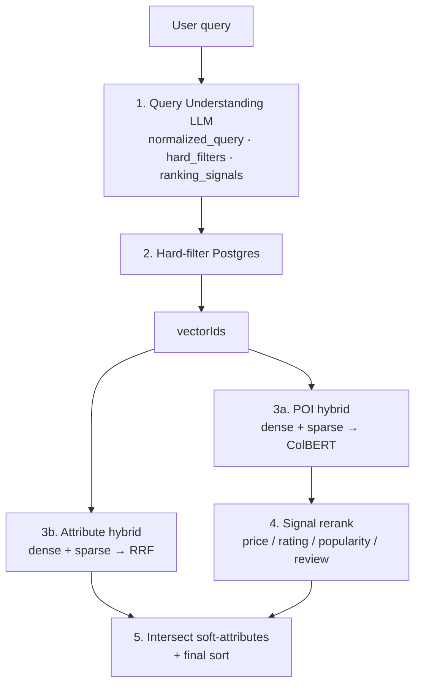
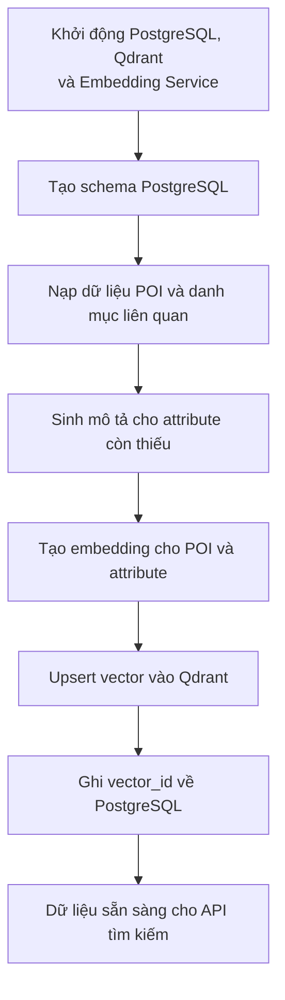
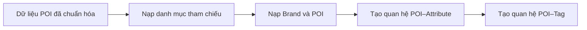
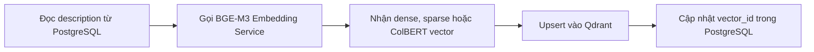

# AI Semantic Search & Ranking (Draft)
`FastAPI` · `OpenAI` · `BGE-M3` · `Qdrant` · `ColBERT` · `PostgreSQL` · `Prisma` · `gRPC` · `Next.js`


> Hệ thống tìm kiếm ngữ nghĩa và xếp hạng POI (Point of Interest) cho bài toán bản đồ — Hackathon Tasco Track 2.

## Nhóm tác giả

**Đội ngũ AI — Cube System Vietnam**

| # | Thành viên |
|---|---|
| 1 | Nguyễn Văn A |
| 2 | Trần Thị B |
| 3 | Lê Văn C |
| 4 | Phạm Thị D |
| 5 | Hoàng Văn E |

---

## Mục lục

1. [Tổng quan giải pháp](#1-tổng-quan-giải-pháp)
2. [Công nghệ sử dụng](#2-công-nghệ-sử-dụng)
3. [Cấu trúc hệ thống](#3-cấu-trúc-hệ-thống)
4. [Hướng dẫn cài đặt và chạy](#4-hướng-dẫn-cài-đặt-và-chạy)
5. [API chính](#5-api-chính)
6. [Đánh giá hệ thống](#6-đánh-giá-hệ-thống)
7. [Kết quả](#7-kết-quả)
8. [Tài liệu tham khảo](#8-tài-liệu-tham-khảo)

---

## 1. Tổng quan giải pháp

Người dùng tìm địa điểm trên bản đồ bằng ngôn ngữ tự nhiên. Truy vấn thường **không** chỉ tên địa điểm cụ thể, mà mang **ý định / ngữ nghĩa**, ví dụ:

> *“quán cà phê yên tĩnh có wifi để làm việc ở Quận 1”*  
> *“ATM còn mở lúc 23h”*  
> *“nhà hàng giá rẻ nổi tiếng”*

Hệ thống tách bài toán thành các lớp rõ ràng:


| Lớp                 | Vai trò                                                                                                        |
| ------------------- | -------------------------------------------------------------------------------------------------------------- |
| **Hard hints**      | `brand`, `category`, `subcategory`, `city`, `district`, `opening_hours` → filter deterministic trên PostgreSQL |
| **Soft attributes** | Taxonomy động (wifi, yên tĩnh, phù hợp làm việc, …) → khớp bằng hybrid semantic search                         |
| **POI corpus**      | Mô tả + metadata POI → hybrid retrieval (dense + sparse + ColBERT)                                             |
| **Ranking signals** | LLM detect preference (price / rating / popularity / review, …) → rerank có giải thích                         |


### Pipeline `/tasco/search`




**Ý tưởng cốt lõi**

1. **LLM** hiểu query → ràng buộc cứng + ranking signals (không chấm điểm từng POI).
2. **Hard filter sớm** trên DB → giảm mạnh candidate.
3. **Soft-attribute** khớp ý định mở bằng embedding + RRF (không hard-map enum).
4. **POI hybrid** trong tập đã lọc: lexical (sparse) + semantic (dense) + ColBERT MaxSim.
5. **Rerank theo preference** khi user nhắc giá / chất lượng / độ phổ biến.
6. **Final order** ưu tiên POI khớp nhiều soft-attribute hơn, rồi mới tới vector score.

Chi tiết methodology: `[AICore/docs/6.tasco_search_methodology.md](AICore/docs/6.tasco_search_methodology.md)`  
Chi tiết ranking signals & AI models: `[AICore/docs/7.ranking_signals_and_ai_models.md](AICore/docs/7.ranking_signals_and_ai_models.md)`

---

## 2. Công nghệ sử dụng

### 2.1. AI / ML


| Thành phần          | Công nghệ                                                          | Vai trò                                                                    |
| ------------------- | ------------------------------------------------------------------ | -------------------------------------------------------------------------- |
| Query Understanding | **GPT-4o-mini** qua **LiteLLM**                                    | Chuẩn hóa query, extract hard filters & ranking signals                    |
| Embedding           | **BGE-M3** (local, gRPC)                                           | Dense (semantic) + Sparse (lexical/BM25-like) + ColBERT (late-interaction) |
| Vector DB           | **Qdrant**                                                         | 2 collections: `poi_data`, `attribute_data`                                |
| Fusion / rerank     | ColBERT MaxSim (POI), **RRF** (attribute), metadata multi-key sort | Ranking đa tầng, explainable                                               |


### 2.2. Backend & hạ tầng


| Thành phần        | Công nghệ                     |
| ----------------- | ----------------------------- |
| API               | FastAPI + `uv` (Python ≥ 3.12) |
| ORM               | Prisma (PostgreSQL)           |
| DB                | PostgreSQL                    |
| Embedding service | gRPC Python service           |
| Orchestration     | Docker Compose, Makefile      |
| Gateway (prod)    | Nginx + Certbot (HTTPS)       |
| Package manager   | **uv** (`uv sync` / `uv run`) |


### 2.3. Frontend


| Thành phần | Công nghệ                                                                          |
| ---------- | ---------------------------------------------------------------------------------- |
| UI         | Next.js 14 (App Router)                                                            |
| Tương tác  | Ô tìm kiếm tiếng Việt → gọi `/tasco/search`, hiển thị query analysis + kết quả POI |


---

## 3. Cấu trúc hệ thống

### 3.1. Kiến trúc runtime

```
Browser ──▶ Nginx (80/443) ──▶ frontend (Next.js :3000)
                            ╲
                             ▶ aicore-api (FastAPI :8000)
                                   │
              ┌────────────────────┼────────────────────┐
              ▼                    ▼                    ▼
         PostgreSQL             Qdrant           aicore-embedding
      (brands/poi/attrs/     poi_data +          gRPC :50051
       signals/tags)         attribute_data      BGE-M3 (CPU)
```

### 3.2. Cấu trúc thư mục

```
AABW-HACKATHON-2026/
├── AICore/                 # Backend FastAPI + data pipeline + docs
│   ├── app/
│   │   ├── api/            # Endpoints
│   │   ├── helpers/        # Query understand, signal reranker, …
│   │   ├── services/       # TascoSearch, Store, VectorStore
│   │   ├── scripts/        # Setup DB, ingest, evaluate
│   │   └── prompts/        # LLM prompts
│   └── docs/               # Tài liệu kỹ thuật
├── EmbeddingService/       # gRPC BGE-M3 hybrid embedding
├── frontend/               # Next.js search UI
├── ai_models/bge-m3/       # Model weights
├── data/                   # Dataset Excel + evaluation output
├── docker/                 # Dockerfiles phụ trợ
├── docker-compose.yml
├── Makefile
└── README.md               # File này
```

### 3.3. Data model (rút gọn)

```
Brand ──< Poi >──< PoiAttribute >── Attribute
              └─< PoiTag >──── Tag
Signal (catalog ranking signal)
```

- **Poi**: địa lý, rating, review_count, popularity_score, price_level, open_hours, description, `vectorId`
- **Attribute**: name + description (LLM-enriched) + `vectorId`
- **poi_attributes**: cầu nối soft-intent ↔ POI sau retrieval

### 3.4. Offline Pipeline — Khởi tạo dữ liệu PostgreSQL và Qdrant

Trước khi API tìm kiếm có thể hoạt động, hệ thống cần chạy một pipeline offline để chuẩn bị dữ liệu.

Pipeline này thực hiện các công việc chính:

1. Tạo cấu trúc bảng trong PostgreSQL.
2. Nạp dữ liệu POI, attribute, tag và ranking signal.
3. Sinh mô tả ngữ nghĩa cho các attribute còn thiếu.
4. Chuyển mô tả POI và attribute thành vector.
5. Lưu vector vào Qdrant và liên kết ngược với PostgreSQL.

Toàn bộ quá trình được thực hiện bằng một lệnh:

```bash
uv run python -m app.scripts.setup_database
```



Pipeline sử dụng cơ chế **upsert**: nếu dữ liệu chưa tồn tại thì tạo mới, nếu đã tồn tại thì cập nhật. Vì vậy có thể chạy lại pipeline khi dữ liệu thay đổi mà không tạo thêm bản ghi trùng lặp.

#### 3.4.1. Tạo schema PostgreSQL

Bước đầu tiên sử dụng Prisma Migration để tạo các bảng theo định nghĩa trong `schema.prisma`.

Các bảng chính gồm:

* `brands`
* `poi`
* `attributes`
* `signals`
* `tags`
* `poi_attributes`
* `poi_tags`

Hai bảng `poi` và `attributes` có trường `vector_id`. Trường này dùng để liên kết bản ghi trong PostgreSQL với vector tương ứng trong Qdrant.

Ở thời điểm mới tạo dữ liệu, `vector_id` có thể để trống và sẽ được cập nhật sau bước ingest vector.

#### 3.4.2. Nạp dữ liệu POI vào PostgreSQL

Script `ingest_poi_data.py` đọc dữ liệu đã được chuẩn hóa trong `poi_seed_data.py` và nạp vào PostgreSQL.

Quá trình ingest gồm ba nhóm công việc:

* Nạp các danh mục dùng chung như ranking signal và attribute taxonomy.
* Nạp thông tin brand và POI.
* Tạo quan hệ giữa POI với attribute và tag.

Trong quá trình xử lý, hệ thống thực hiện thêm một số bước chuẩn hóa như:

* Chuẩn hóa giờ mở cửa.
* Chuyển đổi các trường rating, review count, price level về đúng kiểu dữ liệu.
* Gắn POI với brand tương ứng.
* Tự động tạo attribute hoặc tag mới nếu chưa tồn tại trong cơ sở dữ liệu.



#### 3.4.3. Sinh mô tả cho attribute bằng LLM

Semantic search không nên chỉ dựa trên tên attribute ngắn như `yên tĩnh`, `gần biển` hoặc `phù hợp làm việc`.

Mỗi attribute cần có một mô tả rõ nghĩa, bao gồm ngữ cảnh sử dụng, từ đồng nghĩa và ví dụ truy vấn. Script `generate_attribute_descriptions.py` sử dụng LLM để tạo phần mô tả này.

Quy trình xử lý gồm các bước:

1. Embed tên attribute bằng BGE-M3.
2. Nhóm các attribute gần nghĩa bằng Agglomerative Clustering.
3. Tìm các attribute gần nhau về vector nhưng khác nghĩa để làm dữ liệu phân biệt.
4. Lấy mô tả POI thực tế đang gắn với attribute làm ngữ cảnh.
5. Gửi từng nhóm attribute cho LLM để sinh mô tả.
6. Lưu kết quả trở lại PostgreSQL.

Ví dụ, thay vì chỉ lưu:

```text
yên tĩnh
```

Hệ thống có thể tạo mô tả dạng:

```text
Không gian ít tiếng ồn, phù hợp nghỉ ngơi, đọc sách hoặc làm việc.
Cách gõ: yên tĩnh, ít ồn, không gian tĩnh lặng.
Ví dụ: quán cà phê yên tĩnh để làm việc.
```

LLM trả về các trường dữ liệu chính:

```json
{
  "gloss": "Mô tả ngắn về ý nghĩa của attribute",
  "synonyms": [
    "từ đồng nghĩa",
    "cách diễn đạt tương tự"
  ],
  "queries": [
    "câu truy vấn mẫu 1",
    "câu truy vấn mẫu 2"
  ],
  "englishName": "English attribute name"
}
```

Kết quả sau đó được ghép thành một chuỗi `description` thống nhất để sử dụng khi tạo embedding.

Việc đưa các attribute gần nghĩa vào cùng một batch giúp LLM mô tả chúng rõ ràng hơn và hạn chế trường hợp nhiều attribute có description gần như giống nhau.

#### 3.4.4. Tạo embedding và nạp vào Qdrant

Sau khi POI và attribute đã có description, hệ thống gọi Embedding Service sử dụng mô hình BGE-M3 để tạo vector.

Hai script chính:

```text
ingest_poi_vectors.py
ingest_attribute_vectors.py
```

Luồng xử lý:



Qdrant sử dụng hai collection:

| Collection       | Dữ liệu         | Loại vector              |
| ---------------- | --------------- | ------------------------ |
| `poi_data`       | Mô tả POI       | Dense, Sparse và ColBERT |
| `attribute_data` | Mô tả attribute | Dense và Sparse          |

`poi_data` sử dụng nhiều loại vector hơn vì quá trình tìm POI cần kết hợp semantic retrieval, lexical retrieval và ColBERT reranking.

`attribute_data` sử dụng dense và sparse vector, sau đó hợp nhất kết quả bằng Reciprocal Rank Fusion — RRF.

Mỗi point trong Qdrant cũng chứa payload cơ bản, ví dụ:

```json
{
  "poi_id": "R005",
  "name": "Tên địa điểm",
  "description": "Mô tả dùng để tạo embedding"
}
```

Payload giúp hệ thống xác định vector tìm được thuộc về POI hoặc attribute nào trong PostgreSQL.

#### 3.4.5. Chạy lại pipeline

Khi schema đã tồn tại, có thể bỏ qua bước migration:

```bash
uv run python -m app.scripts.setup_database --skip-migrate
```

Khi cần xóa và tạo lại các collection Qdrant:

```bash
uv run python -m app.scripts.setup_database --recreate-vectors
```

Sau khi pipeline hoàn tất, PostgreSQL chứa dữ liệu nghiệp vụ và metadata, trong khi Qdrant chứa vector phục vụ semantic search. Trường `vector_id` là khóa liên kết giữa hai hệ thống.

---

## 4. Hướng dẫn cài đặt và chạy

### 4.1. Yêu cầu

- Docker + Docker Compose
- [uv](https://docs.astral.sh/uv/) (Python ≥ 3.12 — `uv` tự quản lý interpreter)
- API key LLM (`OPENAI_API_KEY` hoặc provider tương đương qua LiteLLM)
- Model weights BGE-M3 tại `ai_models/bge-m3/` (mount vào EmbeddingService)

Cài `uv` (nếu chưa có):

```bash
curl -LsSf https://astral.sh/uv/install.sh | sh
```

Tải model embedding (chạy từ thư mục gốc repo, trước `make dev`):

```bash
uv run --with huggingface_hub python scripts/download_bge_m3.py
# lưu vào ai_models/bge-m3/
# tải lại: uv run --with huggingface_hub python scripts/download_bge_m3.py --force
```

### 4.2. Cấu hình môi trường

Copy và chỉnh `AICore/.env` từ `AICore/.env.example`:

```bash
cp AICore/.env.example AICore/.env
# Điền OPENAI_API_KEY, kiểm tra DATABASE_URL / QDRANT_* / EMBEDDING_* / LLM_*
```

Các biến quan trọng:


| Biến                                        | Mặc định / ý nghĩa            |
| ------------------------------------------- | ----------------------------- |
| `LLM_MODEL`                                 | `gpt-4o-mini`                 |
| `EMBEDDING_SERVICE_MODEL`                   | `bge-m3`                      |
| `QDRANT_POI_COLLECTION`                     | `poi_data`                    |
| `QDRANT_ATTRIBUTE_COLLECTION`               | `attribute_data`              |
| `TASCO_POI_TOP_K` / `TASCO_ATTRIBUTE_TOP_K` | `20`                          |
| `ATTRIBUTE_SEARCH_RRF_THRESHOLD`            | ngưỡng RRF cho soft-attribute |


### 4.3. Khởi động hạ tầng

Từ thư mục gốc repo:

```bash
make dev
# tương đương: docker compose up -d --build
```

Services:


| Service          | URL                                                                 |
| ---------------- | ------------------------------------------------------------------- |
| aicore-api       | [http://localhost:8000](http://localhost:8000)                      |
| Qdrant           | [http://localhost:6333](http://localhost:6333)                      |
| PostgreSQL       | localhost:5432 (`aicore` / `aicore`)                                |
| Embedding (gRPC) | localhost:50051                                                     |
| Frontend         | [http://localhost:3000](http://localhost:3000) (nếu compose expose) |


Dừng:

```bash
make down
```

### 4.4. Init database

Sau khi hạ tầng đã chạy (`make dev`), khởi tạo schema + seed dữ liệu + ingest vector trong `AICore/` bằng **uv** (không dùng `pip` / `python` hệ thống):

```bash
cd AICore
uv sync
uv run python -m app.scripts.setup_database
```

Lệnh trên thực hiện: Prisma migrate → ingest POI/attributes/signals → sinh mô tả attribute (LLM) → embed & upsert Qdrant.

```bash
# Bỏ qua migrate nếu schema đã có
uv run python -m app.scripts.setup_database --skip-migrate

# Xoá và tạo lại collection Qdrant rồi ingest lại vector
uv run python -m app.scripts.setup_database --recreate-vectors
```

### 4.5. Kiểm tra nhanh

```bash
curl -X POST http://localhost:8000/tasco/search \
  -H 'Content-Type: application/json' \
  -d '{"query": "quán cafe yên tĩnh có wifi ở Quận 1"}'
```

Health:

```bash
curl http://localhost:8000/healthcheck
```

---

## 5. API chính


| Method | Path                           | Mô tả                                                                       |
| ------ | ------------------------------ | --------------------------------------------------------------------------- |
| `GET`  | `/healthcheck`                 | Health check                                                                |
| `POST` | `/tasco/search`                | **Pipeline end-to-end** (understand → filter → hybrid → rerank → intersect) |
| `POST` | `/query-understand/understand` | Chỉ LLM understand (debug)                                                  |
| `POST` | `/poi/filter`                  | Chỉ hard-filter Postgres                                                    |
| `POST` | `/vector/search`               | Chỉ hybrid vector search                                                    |
| `POST` | `/embedding/hybrid`            | Gọi thẳng embedding service                                                 |


### Ví dụ request / response (rút gọn)

```bash
curl -X POST http://localhost:8000/tasco/search \
  -H 'Content-Type: application/json' \
  -d '{"query": "cf yên tĩnh có wifi làm việc q1 giá ổn", "poi_top_k": 10}'
```

```json
{
  "original_query": "cf yên tĩnh có wifi làm việc q1 giá ổn",
  "normalized_query": "Cà phê yên tĩnh có wifi để làm việc ở Quận 1, giá ổn",
  "hard_filters": {
    "brand": null,
    "category": "Quán cà phê",
    "subcategory": null,
    "city": "TP.HCM",
    "district": "Quận 1"
  },
  "ranking_signals": [
    {"signal": "price", "confidence": 0.86},
    {"signal": "attributes", "confidence": 0.91}
  ],
  "count": 3,
  "items": [
    {
      "poi_id": "...",
      "name": "The Workshop Coffee",
      "score": 0.82,
      "matched_attribute_count": 3,
      "matched_attribute_ids": ["A012", "A018", "A025"]
    }
  ]
}
```

---

## 6. Đánh giá hệ thống

### 6.1. Phương pháp

Script: `AICore/app/scripts/evaluate_tasco_search.py`

- Input: sheet đánh giá công khai (expected POI IDs theo query)
- Gọi `POST /tasco/search`
- Metrics @K (mặc định K=10):


| Metric          | Ý nghĩa                                    |
| --------------- | ------------------------------------------ |
| **Recall@K**    | Tỷ lệ POI đúng được retrieve trong top-K   |
| **Precision@K** | Tỷ lệ POI đúng trong top-K                 |
| **nDCG@K**      | Chất lượng thứ tự (graded ranking)         |
| **AP@K / MAP**  | Average Precision / Mean Average Precision |


```bash
cd AICore
uv run python -m app.scripts.evaluate_tasco_search
# Output mặc định: data/tasco_search_evaluation.xlsx
```

### 6.2. Tiêu chí đánh giá nội bộ


| Khía cạnh           | Cách đánh giá                                                         |
| ------------------- | --------------------------------------------------------------------- |
| Query understanding | Hard filters / signals đúng intent (manual + sample set)              |
| Soft-intent         | Attribute hits có giải thích được (`matched_attribute_ids`)           |
| Ranking preference  | Query có “giá rẻ / nổi tiếng / ngon” thì metadata rerank có hiệu lực  |
| Latency             | Understand + 2 nhánh vector song song; hard filter giảm candidate sớm |
| Explainability      | Response có đủ audit trail để giải thích kết quả cho stakeholder      |


---

## 7. Kết quả

> **Lưu ý:** Bảng dưới đây là **mockup tạm thời** phục vụ báo cáo / demo. Số liệu thật lấy từ `data/tasco_search_evaluation.xlsx` sau khi chạy evaluation trên môi trường đã setup đầy đủ.

### 7.1. Metrics tổng hợp (mock)


| Metric            | Giá trị (mock @K=10) |
| ----------------- | -------------------- |
| Mean Recall@10    | **0.78**             |
| Mean Precision@10 | **0.41**             |
| Mean nDCG@10      | **0.72**             |
| MAP@10            | **0.69**             |


### 7.2. Kết quả theo nhóm query (mock)


| Nhóm query                | Ví dụ                       | Recall@10 | nDCG@10 | Nhận xét                           |
| ------------------------- | --------------------------- | --------- | ------- | ---------------------------------- |
| Hard geo + category       | “cafe Quận 1”               | 0.85      | 0.80    | Hard-filter hiệu quả               |
| Soft-intent đa thuộc tính | “yên tĩnh có wifi làm việc” | 0.74      | 0.68    | Phụ thuộc attribute taxonomy + RRF |
| Preference giá / rating   | “nhà hàng ngon giá rẻ”      | 0.71      | 0.70    | Signal rerank cải thiện thứ tự     |
| Opening hours             | “ATM còn mở lúc 23h”        | 0.80      | 0.75    | Constraint giờ lọc đúng            |
| Mixed language / teencode | “cf q1 hcm”                 | 0.76      | 0.71    | Normalize LLM ổn định              |


### 7.3. Ví dụ qualitative (mock)


| Query                                 | Top-1 kỳ vọng (mock)        | Vì sao hợp lý                   |
| ------------------------------------- | --------------------------- | ------------------------------- |
| “quán cafe yên tĩnh có wifi ở Quận 1” | The Workshop Coffee         | Khớp soft attrs + đúng district |
| “Highlands Nguyễn Huệ”                | Highlands Coffee Nguyễn Huệ | Hard brand + location           |
| “ATM mở 24/7 gần trung tâm”           | (POI ATM 24/7)              | Attribute 24/7 + opening_hours  |


---

## 8. Tài liệu tham khảo

### Trong repo


| Tài liệu                                                                                           | Nội dung                                                    |
| -------------------------------------------------------------------------------------------------- | ----------------------------------------------------------- |
| `[AICore/docs/6.tasco_search_methodology.md](AICore/docs/6.tasco_search_methodology.md)`           | Retrieval & ranking methodology chi tiết                    |
| `[AICore/docs/7.ranking_signals_and_ai_models.md](AICore/docs/7.ranking_signals_and_ai_models.md)` | Ranking signals, LLM/Embedding, cách giải thích kết quả     |
| `[AICore/README.md](AICore/README.md)`                                                             | Hướng dẫn setup DB / ingest / vector chi tiết               |


### Dataset

- `data/ai_maps_track2_dataset_participants.xlsx` — POI dataset Track 2
- `data/tasco_search_evaluation.xlsx` — output evaluation

---

## Giấy phép / Hackathon

Dự án phục vụ **AABW Hackathon 2026 — Tasco Track 2 (AI Maps / Semantic Search)**.

```bash
# Quick start (dùng uv xuyên suốt)
uv run --with huggingface_hub python scripts/download_bge_m3.py
make dev
cd AICore && uv sync && uv run python -m app.scripts.setup_database
curl -X POST http://localhost:8000/tasco/search \
  -H 'Content-Type: application/json' \
  -d '{"query": "quán cafe yên tĩnh có wifi ở Quận 1"}'
```

